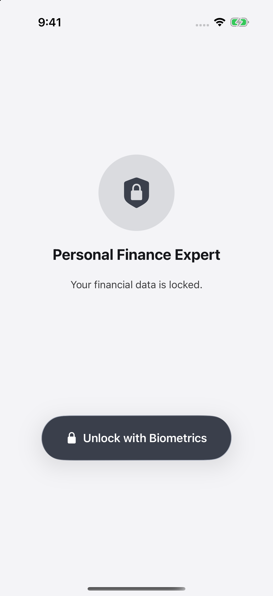
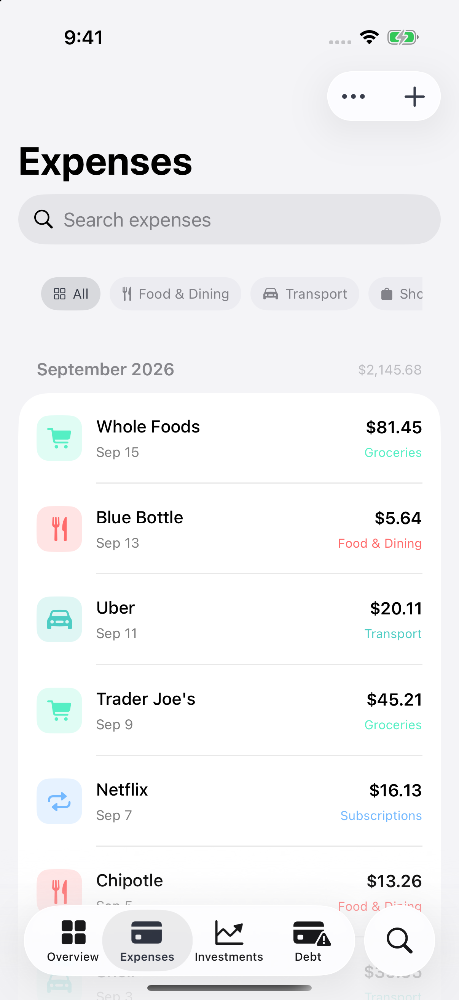
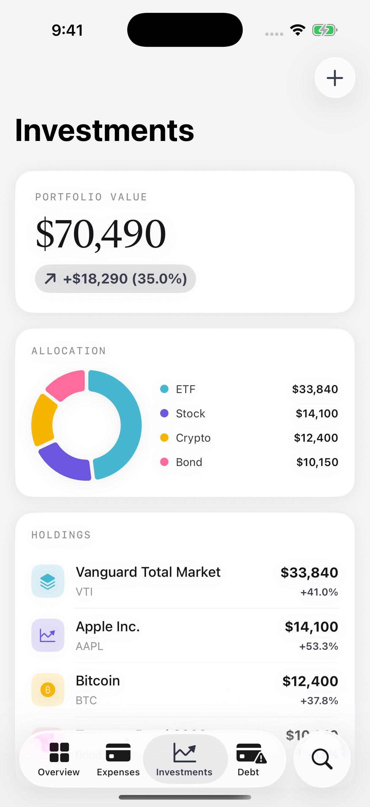
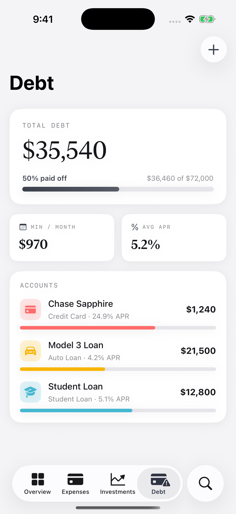
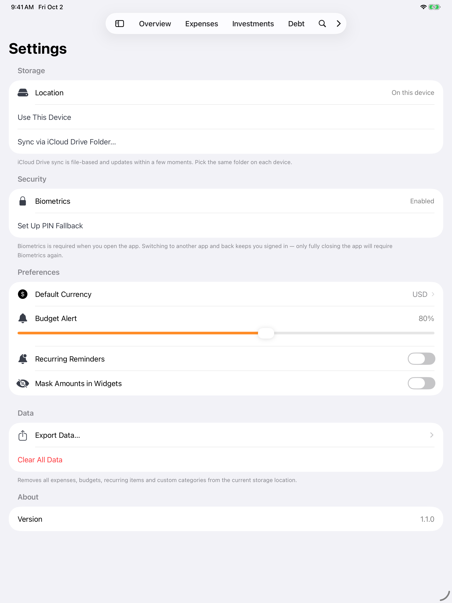
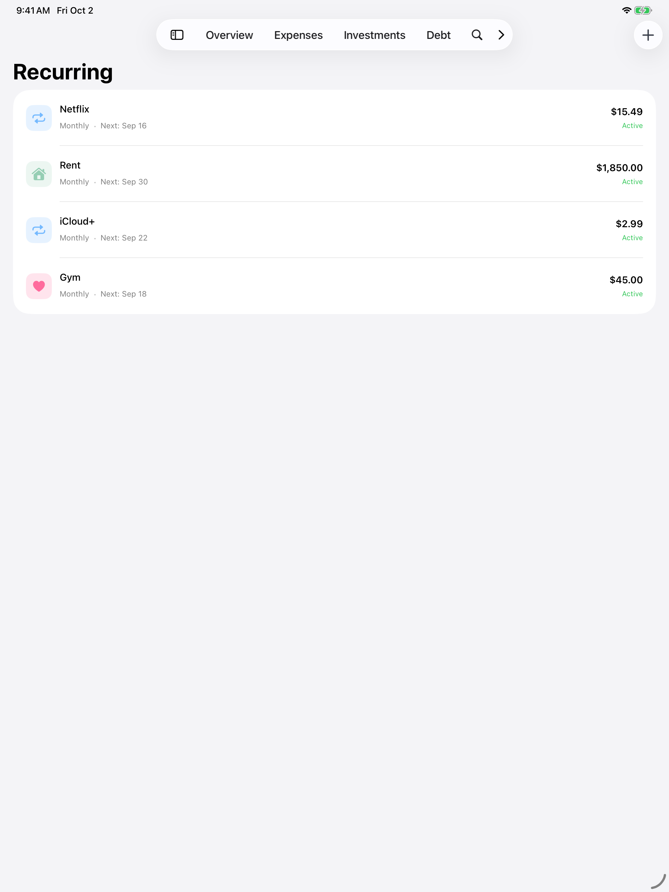
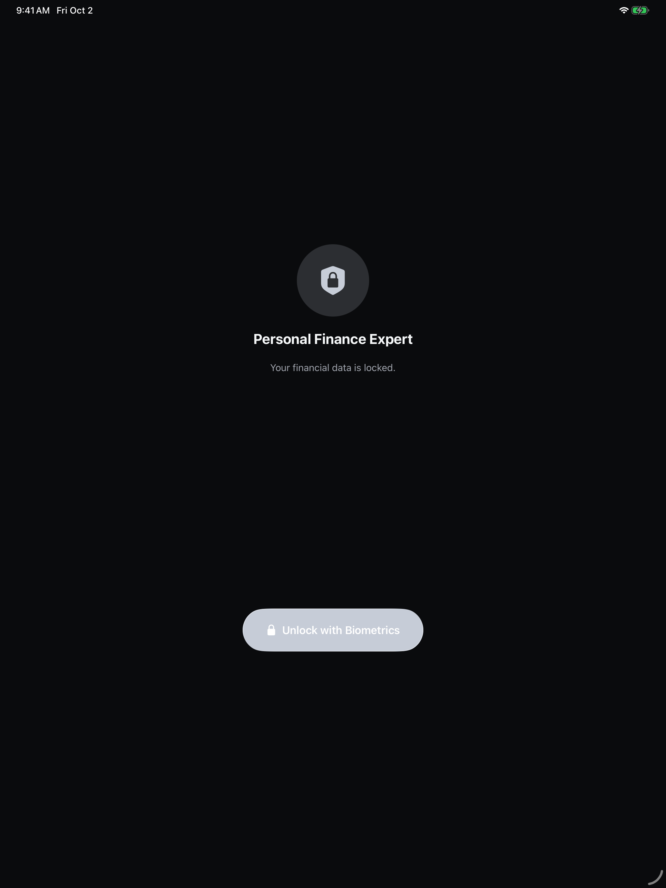

<p align="center">
  
</p>

<h1 align="center">Personal Finance Expert</h1>

<p align="center">
  Expenses, budgets, investments and debt — on your iPhone, iPad and Mac.<br/>
  No account, no server, no analytics. Your data stays in a JSON file you own.
</p>

<p align="center">
  
  
  
</p>

---

Most personal finance apps want a login, a subscription, and a connection to your bank.
This one doesn't. You type what you spent, and it keeps the numbers on your device.
It was written for one person's actual budgeting, so the features are the ones that
got used, not the ones that demo well.

| Overview | Expenses | Investments | Debt |
|:---:|:---:|:---:|:---:|
|  |  |  |  |

On iPad and Mac the tab bar becomes a sidebar, and the whole app follows the system
appearance:

| Settings | Recurring | Dark mode |
|:---:|:---:|:---:|
|  |  |  |

## What it does

**Spending.** Log an expense in a few taps, with category, payment method and an
optional receipt photo. Receipts run through on-device OCR (Vision), which reads the
total and the merchant off the image. Once you've filed a merchant under a category,
the app remembers and picks it for you next time.

**Budgets.** Monthly limits per category, with progress bars that turn red when you
go over. The editor suggests a limit from your average spend over the last three
months, so you don't have to guess.

**Recurring.** Subscriptions, rent and bills with due dates, plus optional local
notifications the morning something is due.

**Investments and debt.** Holdings with cost basis, market value and gain/loss, an
allocation donut by asset type; debts with balance, APR, minimum payment and payoff
progress. Net worth is investments minus debt, recorded as a daily snapshot so the
Overview chart has a trend line.

**Everything else.** Search across every section at once, CSV export per section, a
one-page PDF summary, Face ID or Touch ID with a PIN fallback, twenty currencies,
Siri shortcuts ("log an expense", "what's my net worth"), and ten home and lock
screen widgets.

## Where your data lives

There is no backend, and nothing leaves your devices. On first launch you pick one of
two places:

1. **On this device** — a JSON file in Application Support, private to that device.
2. **An iCloud Drive folder you choose** — the app writes the same JSON there through
   a security-scoped bookmark, and iCloud Drive syncs it to your other devices. This
   works without the iCloud entitlement, which is why it runs on a free Apple
   developer account.

Switching between the two migrates what you already have. `CloudKitManager` is named
for a CloudKit backend that doesn't exist yet: it exposes async CRUD and currently
writes to local JSON, so swapping in real CloudKit later is one file's worth of work.

## Design

The UI is built from stock iOS 26 and macOS 26 components, so Liquid Glass comes from
the system: the tab bar and sidebar, toolbars, the search tab, prominent buttons.
Content cards stay opaque underneath it.

The palette is graphite — slate in light mode, silver in dark. Money is set in a
serif face (New York), structural labels in uppercase monospace, and charts are
monochrome. Color is kept for meaning: red when a budget is blown or a balance is
negative, category colors in the breakdowns.

## Building

You need Xcode 26 or later with the iOS 26 SDK, and a Mac running macOS 26 or later.

```bash
git clone https://github.com/<you>/personal-finance-expert.git
cd personal-finance-expert
open PersonalFinanceExpert.xcodeproj
```

Set your team on both the `PersonalFinanceExpert` and `PersonalFinanceWidgets`
targets under Signing & Capabilities, then build and run. A free personal Apple team
is enough — the project deliberately avoids anything that needs a paid account.

Two notes if you're poking at the project file:

- `FinanceApp/` and `PersonalFinanceWidgets/` are file-system synchronized folders, so
  new Swift files compile without being registered anywhere.
- `Info.plist` is generated. Set keys through `INFOPLIST_KEY_*` build settings; the
  widget's `NSExtension` dictionary is the one exception, in `Config/`.

To build without a signing identity, for a simulator:

```bash
xcodebuild -project PersonalFinanceExpert.xcodeproj -scheme PersonalFinanceExpert \
  -destination 'platform=iOS Simulator,name=iPhone 17' \
  CODE_SIGN_IDENTITY=- CODE_SIGN_STYLE=Manual DEVELOPMENT_TEAM= build
```

## Layout

```
FinanceApp/
├── App/                 app entry: lock screen → storage picker → main navigation
├── Models/              Expense, RecurringExpense, Budget, Category (+ theme), Currency
├── ViewModels/          expenses, budgets, recurring, categories, analytics
├── CloudKit/            storage facade over the local JSON store + net worth history
├── Views/               Dashboard, Expenses, Categories, Settings, Search, Common
├── Authentication/      Face ID / Touch ID and the Keychain PIN
├── Investments.swift    model + view model + views, one file per feature
├── Debts.swift
├── Export.swift         CSV and the PDF report
└── Intents.swift        App Intents for Siri and Shortcuts
PersonalFinanceWidgets/  widget extension, reads a snapshot from the App Group
Config/                  entitlements and the widget Info.plist
```

## Known rough edges

Honest list, in case you plan to rely on this:

- **Recurring items don't roll forward.** Once a due date passes it stays in the past
  until you edit the item, so reminders and the bills widget stop being useful.
- **Mixed currencies are added together.** Totals and net worth sum the numbers
  without converting, so only one currency at a time really works today.
- **Amount fields expect a dot.** On a locale that types `12,50` the Save button
  stays disabled.
- **The iCloud Drive folder option needs care.** There's no file coordination yet, so
  editing on two devices at once, or opening the app before iCloud has downloaded the
  file, can cost you data. The single-device option has none of these problems.
- **Biometrics has no passcode fallback.** If Face ID locks out and you never set a
  PIN, you're locked out of the app until it works again.
- **No tests.**

## Roadmap

Subscription radar (spot recurring charges automatically, flag price rises),
allocation targets with drift, net worth projection and a debt payoff simulator,
CSV import from bank statements, and CloudKit sync if this ever gets a paid
developer account.

## License

MIT. See [LICENSE](LICENSE).
